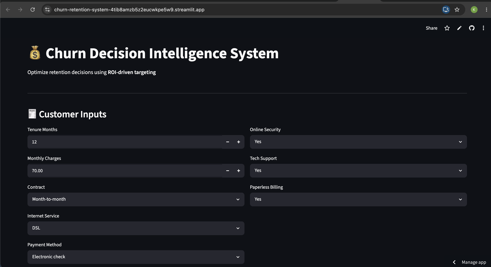
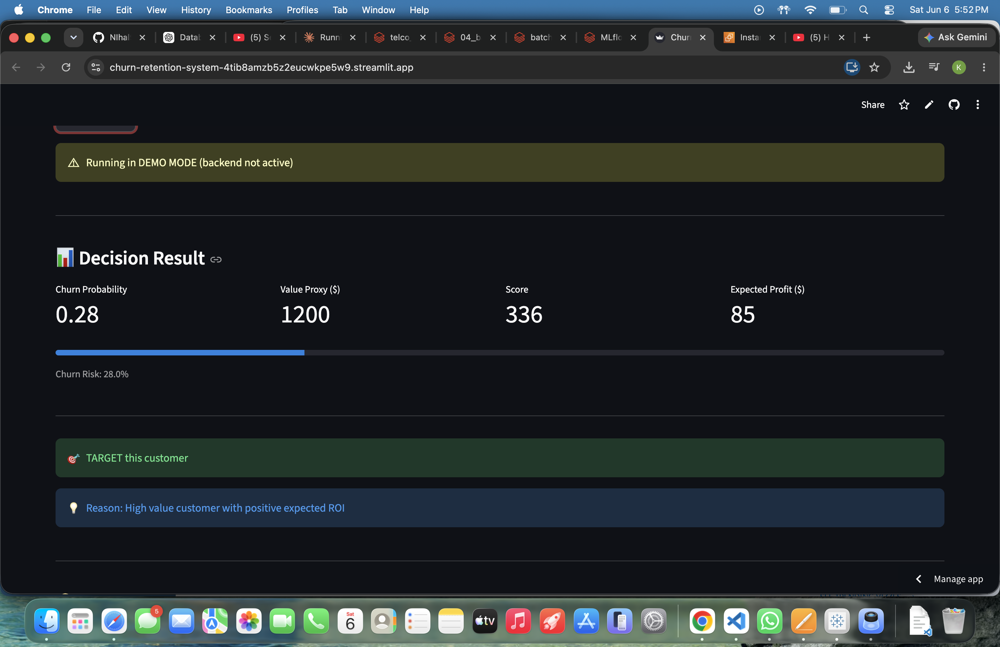
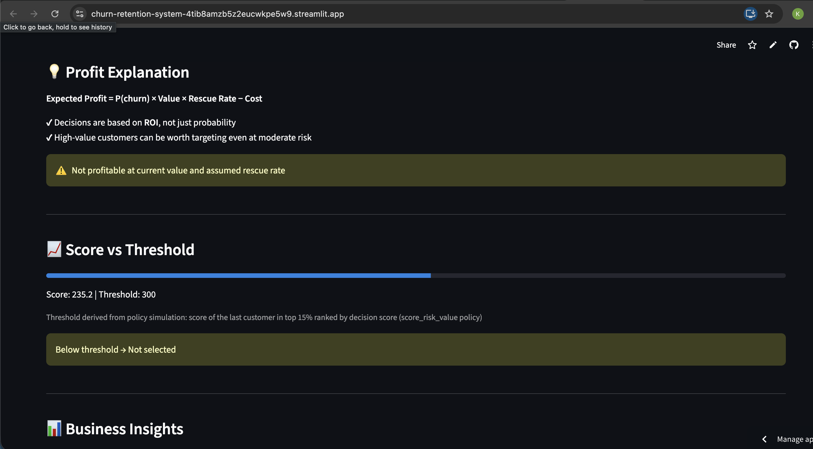
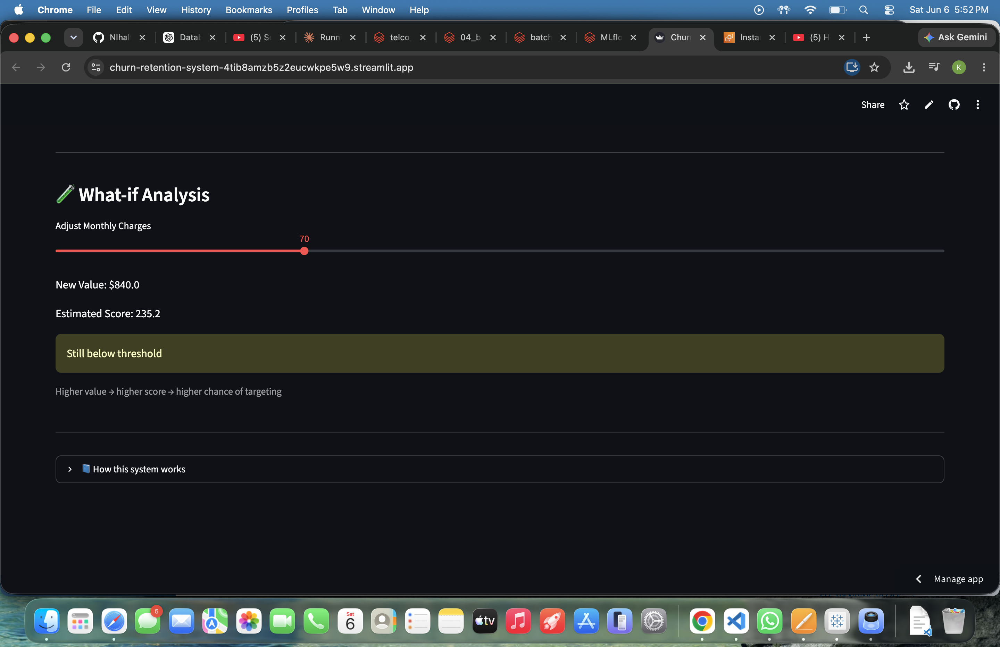
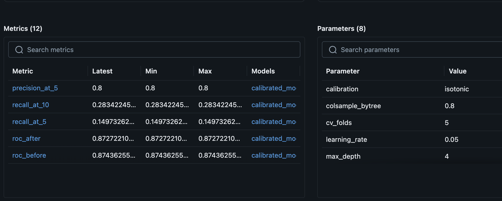
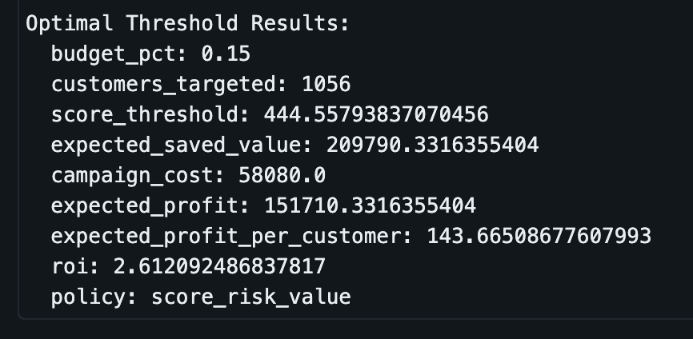
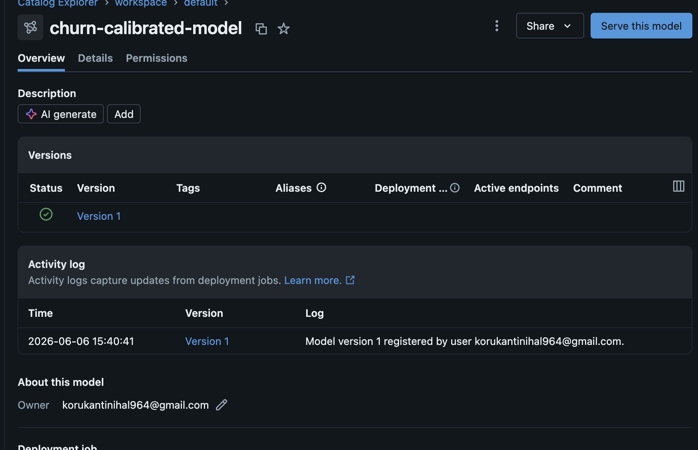

# 💰 Churn Retention & Decision System


[View on GitHub](https://github.com/NIhal964/churn-retention-system)

Most churn models stop at telling you who's going to leave. I wanted to know: given a limited budget, which customers are actually worth the money to save?

That's a different question — and it needs a different kind of system. This project builds one.

---

## Live Demo

| Interface | Link |
|---|---|
| Streamlit UI | [churn-retention-system.streamlit.app](https://churn-retention-system-4tib8amzb5z2eucwkpe5w9.streamlit.app/) |
| FastAPI (AWS EC2) | Stopped to manage costs — demo mode activates automatically |
| Docker Hub | `docker pull nihal4051/churn-api:v3` |

The EC2 instance is stopped when not in use. The Streamlit app switches to demo mode automatically — churn probability is fixed at 0.28 as a representative value, but score, profit, and the targeting decision all respond to whatever you input.

---

## UI

### Input form


### Decision result — $70/month customer, not worth targeting
Score 235.2 falls below the threshold of 300. Even with a 28% churn risk, the campaign cost ($55) isn't justified at this value.



### Score vs threshold
The threshold isn't arbitrary — it's the score of the last customer in the top 15% when ranked by `churn_probability × value_proxy`, derived from the policy simulation.



### What-if analysis
Slide the monthly charges up and watch the targeting decision flip. This is the point of the whole project — value drives the decision, not just risk.



---

## Results

| Metric | Value |
|---|---|
| ROC-AUC (XGBoost) | 0.8408 |
| PR-AUC | 0.6525 |
| Precision@10% | 0.771 |
| Lift@10% | 2.91× |
| Value-aware vs risk-only profit gain | ~55% at every budget level |
| Best policy expected profit | **$151,710** |
| Best policy ROI | **2.61×** |
| Customers targeted (best policy) | 1,056 of 7,043 |

---

## The Core Idea

A customer with 90% churn probability paying $20/month is worth less to retain than one at 60% probability paying $110/month. Standard churn models miss this completely.

```
Decision Score = churn_probability × value_proxy
```

From there, the system runs a full economic simulation — contact costs, discount offered, estimated rescue rate — and picks who to target under a given budget. The output isn't a probability. It's a ranked intervention list with expected profit attached.

The hardest part to build was the decision and policy layer — figuring out how to go from "here are my model outputs" to "here is who you should actually call, and why, and what it's worth." That's where most of the design work went.

---

## How It's Built

```
Raw Data (Delta)
    ↓
Feature Engineering
    ↓
XGBoost + Isotonic Calibration
    ↓
MLflow Tracking + Model Registry
    ↓
Batch Scoring (Delta)
    ↓
Policy Simulation (3 strategies × 3 budgets × 3 rescue rates)
    ↓
Threshold Optimization
    ↓
Intervention Table (Delta)
    ↓
FastAPI on AWS EC2 → Streamlit UI
```

| Layer | What it does |
|---|---|
| Data Pipeline | Ingestion, validation, leakage prevention, splitting |
| Modeling | XGBoost churn prediction |
| Calibration | Isotonic regression for reliable probabilities |
| Policy Layer | Evaluates 3 targeting strategies across budget and rescue rate grid |
| Decision Layer | Picks the best policy by expected profit |
| Execution Layer | Converts policy into a score threshold for deployment |
| API | FastAPI, Dockerized, on AWS EC2 |
| UI | Streamlit with demo mode fallback |
| Monitoring | Prediction and feature drift detection |

---

## Databricks Pipeline

I also ported the full pipeline to Databricks to work with the production data engineering pattern — Delta tables, MLflow tracking, and model registry — rather than just local CSVs and a local tracking server.

```
telco_customer_churn (Delta)
    ↓
01_feature_engineering → telco_churn_features (Delta)
    ↓
02_train_and_register → MLflow experiment + Model Registry
    ↓
03_batch_score → telco_churn_interventions (Delta)
```

| What was built | Detail |
|---|---|
| Delta tables | `telco_customer_churn`, `telco_churn_features`, `telco_churn_interventions` |
| MLflow experiment | Params, metrics, calibration curve — all tracked |
| Registered model | `churn-calibrated-model` Version 1 in Unity Catalog |
| Policy runs | 27 nested MLflow runs (3 policies × 3 budgets × 3 rescue rates) |
| ROC-AUC on Databricks | 0.8744 |
| Best policy profit | $151,710 |







One honest note: Free Edition uses serverless single-node compute, so this isn't distributed Spark processing. The architecture — Delta, MLflow, Model Registry — is the same as a production deployment. The scale isn't.

**On the ROC-AUC difference (0.8408 local vs 0.8744 Databricks):** same model, same seed, different preprocessing path. The local pipeline uses a sklearn ColumnTransformer on raw data with `pd.get_dummies(drop_first=True)`. The Databricks pipeline trained on an already-encoded Delta table where Monthly Charges was explicitly cast to float before encoding, booleans were converted to int, and column names were sanitized. Different feature matrix going in = different model coming out. Not leakage, not a split difference — just two slightly different preprocessing implementations of the same logic. The local number (0.8408) is the one to cite since it matches the deployed model.

See [/databricks](./databricks/) for all three notebooks.

---

## Data Pipeline

```
src/data/
  ├── load.py       # Excel ingestion
  ├── validate.py   # Cleaning, null handling, encoding
  ├── split.py      # 80/20 stratified split (random_state=42)
  └── prepare.py    # Orchestration
```

Churn Score, CLTV, Churn Label, and Churn Reason are dropped before any modeling. These are post-hoc labels — they wouldn't exist at prediction time and including them would be leakage.

---

## Modeling

| Model | ROC-AUC | PR-AUC | Brier Score |
|---|---|---|---|
| Logistic Regression (baseline) | 0.8332 | 0.6215 | 0.1412 |
| XGBoost uncalibrated | 0.8408 | 0.6525 | 0.1373 |
| XGBoost + Isotonic (final) | **0.8406** | **0.6478** | **0.1377** |

```python
XGBClassifier(
    n_estimators=300,
    max_depth=4,
    learning_rate=0.05,
    subsample=0.8,
    colsample_bytree=0.8,
    eval_metric="logloss",
    random_state=42
)
```

XGBoost was chosen for ranking performance, not just accuracy. For a campaign targeting the top 10% of customers, lift matters more than overall AUC.

Feature importance analyzed via SHAP TreeExplainer — see `src/modeling/explain.py`. Helps explain which features drive individual targeting decisions, not just global importance.

---

## Probability Calibration

Tree models are often miscalibrated — the predicted probability of 0.7 doesn't necessarily mean 70% of those customers actually churn. When you're plugging probabilities directly into a profit formula, that matters.

Applied isotonic regression via `CalibratedClassifierCV(cv=5)`:

| Metric | Before | After |
|---|---|---|
| ROC-AUC | 0.8408 | 0.8406 |
| PR-AUC | 0.6525 | 0.6478 |
| Brier Score | 0.1373 | 0.1377 |

Calibration made marginal difference here — consistent across local and Databricks runs. The base XGBoost probabilities are already reasonably well-calibrated on this dataset. With more data and more miscalibration to start with, isotonic typically helps more.

---

## Ranking Performance

For a retention campaign targeting a small fraction of customers, ranking metrics matter more than overall accuracy.

| Metric | Logistic | XGBoost |
|---|---|---|
| Precision@5% | 0.729 | **0.814** |
| Precision@10% | 0.700 | **0.771** |
| Recall@5% | 0.136 | **0.152** |
| Recall@10% | 0.262 | **0.289** |
| Lift@10% | 2.64× | **2.91×** |

In the top 10% of customers ranked by churn probability, XGBoost finds nearly 3× as many actual churners as random selection would.

---

## Decision Layer

Three targeting policies, each with a different philosophy:

| Policy | Formula | Logic |
|---|---|---|
| Risk only | `P(churn)` | Target whoever is most likely to leave |
| Risk × Value | `P(churn) × ValueProxy` | Target whoever has the most revenue at risk |
| Risk × Value × Weight | `P(churn) × ValueProxy × sensitivity_weight(p)` | Downweight extremes, focus on persuadable customers |

The sensitivity weight penalizes customers at the probability extremes:

```python
def sensitivity_weight(p):
    return max(0.0, 1 - abs(p - 0.5) * 2)
```

Someone at 95% churn probability is probably already gone. Someone at 5% probably isn't going anywhere. The interesting customers to target are in the middle.

---

## Economic Simulation

```
Expected Profit =
  Σ(P(churn) × ValueProxy × rescue_rate)
  − (contact_cost + discount) × customers_targeted
```

Campaign parameters from `configs/business.yaml`:

| Parameter | Value |
|---|---|
| Contact cost | $5 |
| Discount offered | $50 |
| Value horizon | 12 months |
| Rescue rates tested | 10%, 20%, 30% |
| Budgets tested | 5%, 10%, 15% of customers |


| Policy | Budget | Avg Expected Profit | Avg ROI |
|---|---|---|---|
| score_risk_only | 5% | $26,494 | 1.37× |
| score_risk_only | 10% | $45,758 | 1.18× |
| score_risk_only | 15% | $56,707 | 0.98× |
| **score_risk_value** | **5%** | **$42,697** | **2.21×** |
| **score_risk_value** | **10%** | **$66,263** | **1.71×** |
| **score_risk_value** | **15%** | **$81,780** | **1.41×** |
| score_risk_value_weighted | 5% | $26,874 | 1.39× |
| score_risk_value_weighted | 10% | $47,663 | 1.23× |
| score_risk_value_weighted | 15% | $64,125 | 1.10× |

Value-aware targeting beats risk-only by ~55% at every budget level. The weighted strategy underperforms both — penalizing high-probability customers hurts more than it helps on this dataset.


---

## Threshold Optimization

The best policy gets converted into an actual cutoff score for deployment — not a probability threshold, a decision score threshold.


```python
# Last customer in the targeted group sets the threshold
score_threshold = targeted["score"].iloc[-1]
```

Best run:

| Parameter | Value |
|---|---|
| Policy | `score_risk_value` |
| Budget | 15% |
| Rescue rate | 30% |
| Customers targeted | 1,056 |
| Expected profit | **$151,710** |
| ROI | **2.61×** |

---

## Deployment

FastAPI backend, Dockerized and deployed on EC2. Image is on Docker Hub:

```bash
docker pull nihal4051/churn-api:v3
docker run -p 8000:8000 nihal4051/churn-api:v3
```

Or run locally:
```bash
uvicorn src.api.app:app --reload
```

The `/decision` endpoint takes customer features and returns churn probability, decision score, intervention flag, and expected profit. The Streamlit frontend calls this endpoint and falls back to demo mode if it's unreachable.

CI/CD runs on GitHub Actions — validates dependencies, runs tests, checks API startup, and builds the Docker image on every push.

---

## Prediction Distribution Monitoring

A baseline is saved at training time:

```python
baseline = {
    "avg_churn_prob":      0.2677,
    "std_churn_prob":      0.2445,
    "avg_monthly_charges": 64.09,
    "std_monthly_charges": 29.90
}
```

Live predictions get compared against it. If the distribution drifts, it flags early — before model performance degrades silently in production.

```
Current avg churn probability:  0.1700
Baseline avg churn probability: 0.2677
⚠️  Drift detected
```

---

## Setup

```bash
git clone https://github.com/NIhal964/churn-retention-system
cd churn-retention-system
pip install -r requirements.txt

# Run full pipeline
python -m src.pipeline.run_pipeline

# API
uvicorn src.api.app:app --reload

# UI
streamlit run app_streamlit.py

# Tests
pytest tests/
```

---

## Project Structure

```
churn-retention-system/
├── configs/
│   ├── business.yaml
│   ├── decision_config.json
│   └── monitoring_baseline.json
├── databricks/
│   ├── 01_feature_engineering.py
│   ├── 02_train_and_register.py
│   └── 03_batch_score.py
├── src/
│   ├── api/
│   ├── data/
│   ├── features/
│   ├── modeling/
│   ├── decisioning/
│   ├── pipeline/
│   └── monitoring/
├── assets/
│   ├── databricks/
│   ├── streamlit/
│   ├── policy_comparison.png
│   ├── profit_vs_budget.png
│   └── threshold_curve.png
├── models/
├── tests/
├── Dockerfile
├── requirements.txt
└── README.md
```

---

## Limitations

The biggest one: this system can't measure whether a campaign actually worked. The `rescue_rate` parameter is an assumption — I set it to 20% based on reasonable industry estimates, but without a randomized experiment (treatment vs control group), there's no way to know the true effect.

That's what uplift modeling solves. You need a dataset with both treated and untreated customers to estimate the actual incremental impact of reaching out. With observational data alone, you're estimating, not measuring.

Other limitations:

- Value proxy is `monthly_charges × 12`, not actual CLTV
- Rescue rate is assumed, not measured — scenario analysis run across 10%, 20%, and 30% to bound the profit estimate. No causal estimate is available from observational data alone. A randomized experiment (treatment vs control) would be required to measure the true effect.
- No saturation modeling — the simulation assumes each additional customer still contributes positive expected value, which won't hold at scale

---

## What I'd Do Differently

Get a better dataset. Specifically, one with treatment and control groups — who was contacted, who wasn't, and what happened to both. That's what would allow genuine uplift modeling instead of assumption-based rescue rates. The right way to measure rescue rate is an A/B test: contact a random subset, hold out a control group, measure the difference. I built that kind of sequential testing infrastructure in a separate project — the missing piece here is the data, not the methodology. The decision layer architecture would stay the same; the inputs to the profit formula would actually be measured rather than assumed.

---

## Testing

```bash
pytest tests/
```

Validates API availability and prediction behavior on high and low churn input profiles.