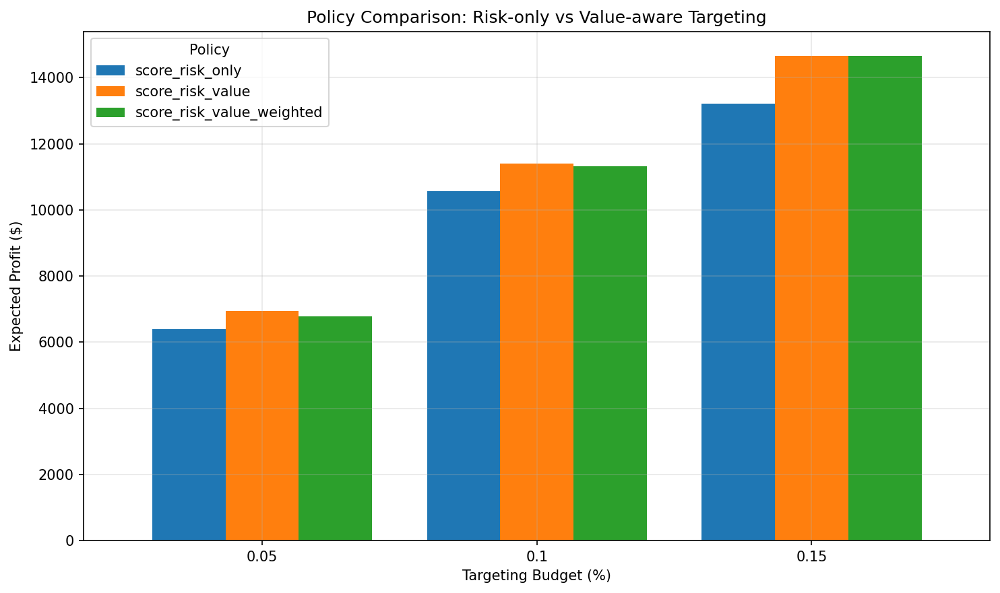
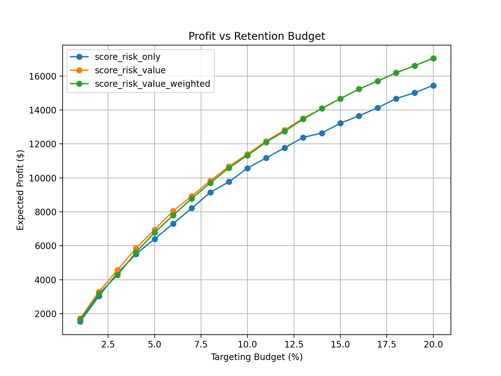
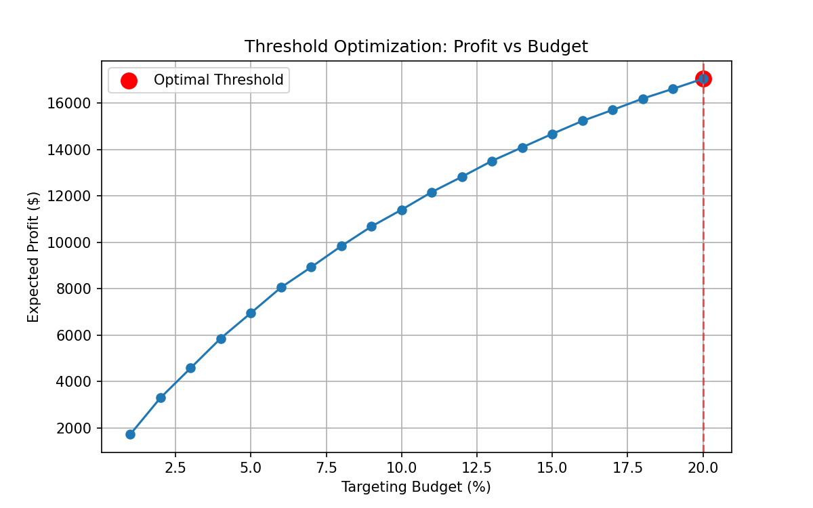

# 💰 Value-Aware Churn Optimization & Decision System

## 📌 Overview

Traditional churn models answer:

> “Who will churn?”

This system answers a more actionable question:

> *“Who should we target to maximize retained revenue under budget constraints?”*

By combining *churn prediction, customer value, and campaign economics, this system converts predictions into **profit-driven decisions*.

---

## 🌐 Live Demo

- 🎯 *Streamlit UI*: https://your-app.streamlit.app  

- ⚙️ *API (AWS EC2)*: http://<your-ec2-ip>:8000/docs  

> ⚠️ Note: Backend API may be inactive when EC2 is stopped.  

> The UI includes a *demo mode fallback* to ensure usability.


---

##  Key Results

* ~**3× lift** in retained value within top-decile targeting
* ~5–10% improvement observed in simulation experiments
* **Break-even rescue rate:** ~8–10%
* Optimal targeting occurs near the upper boundary of the tested budget range (10–15% in experiments)

 Demonstrates that **value-aware targeting significantly improves ROI**

## 📊 Policy Comparison



Value-aware targeting significantly outperforms probability-only targeting in expected profit.

## 📈 Profit vs Budget



- Profit increases with budget but *diminishes gradually*
- Optimal point appears near *upper boundary of tested range*

 Indicates that under current assumptions, *additional targeting remains profitable*

## 🎯 Threshold Optimization



Profit-based thresholding converts policy decisions into *deployable targeting rules*, avoiding arbitrary cutoffs.
---

## Core Idea

```text
Prediction ≠ Decision
```

A high churn probability customer is not always worth targeting.

We use:

```text
Decision Score = churn_probability × value_proxy
```

to prioritize **high-value, persuadable customers**

---

##  System Architecture

```text
Data Pipeline → Model → Calibration → Policy → Decision → API → UI → Monitoring
```

### Layers

- *Data Pipeline* → ingestion, validation, splitting  
- *Modeling* → churn prediction (XGBoost)  
- *Calibration* → reliable probabilities (Isotonic Regression)  
- *Policy Layer* → evaluates targeting strategies  
- *Decision Layer* → profit-based optimization  
- *Execution Layer* → threshold-based targeting  
- *API* → FastAPI(dockerized deployed on AWS)
- *UI* → Streamlit Cloud frontend
- *Monitoring* → drift detection

---

##  Data Pipeline

Modular pipeline design:

```text
src/data/
  ├── load.py
  ├── validate.py
  ├── split.py
  └── prepare.py
```

Ensures:

* reproducibility
* clean train/test separation
* leakage prevention

---

##  Modeling

### Models Evaluated

* Logistic Regression (baseline)
* XGBoost (final)

### Final Model Performance

* ROC-AUC: **0.86**
* PR-AUC: **0.68**

 Selected for strong ranking performance

---

##  Probability Calibration

Tree models are often miscalibrated.

Applied **Isotonic Regression**:

* Calibrated ROC-AUC: **0.859**
* Brier Score: **0.13**

 Enables reliable **financial decision-making**

---

## 📊 Ranking Performance

Retention campaigns target a small fraction of users.

* Precision@5%: **0.83**
* Precision@10%: **0.79**
* Lift@10%: **~3×**

Model identifies significantly more churners than random targeting

---

##  Decision Layer

### Policies

* Risk-only → P(churn)
* Risk × Value → P(churn) × ValueProxy
* Weighted strategy → penalizes extreme cases

### Insight

```text
Value-aware targeting consistently outperforms probability-only strategies
```

---

## 📈 Economic Simulation

Expected profit:

```text
Expected Profit =
Σ(P(churn) × ValueProxy × rescue_rate)
− Campaign Cost
```

Simulates:

* budget constraints
* rescue rate(campaign effectiveness)
* campaign cost

---

##  Key Analyses

## Profit vs Budget
- Reveals diminishing returns  
- Optimal near upper tested range  

### Profit vs Rescue Rate
- Break-even: ~8–10%  

### Policy Comparison
- Validates value-aware strategies  


---

##  Deployment

## Backend (AWS EC2)

* FastAPI served via Docker
* Public API exposed via EC2

### API

```bash
uvicorn src.api.app:app --reload
```

### Docker

```bash
docker build -t churn-api .
docker run -p 8000:8000 churn-api
```

---
## Frontend (Streamlit Cloud)

* UI deployed on Streamlit Cloud
* Communicates with API via HTTP

## Configuration (Secrets)
API endpoint managed via Streamlit secrets:

```bash
API_URL = "http://<your-ec2-ip>:8000/decision
```
Prevents hardcoding infrastructure details

## Demo Mode (Resilience)
If backend is unavailable:

* UI automatically switches to demo mode
* Uses simulated outputs

    Ensures uninterrupted demo experience

##  CI/CD

Implemented using **GitHub Actions**

Validates:

* dependencies
* API startup
* test cases
* Docker build

 Ensures reliable and reproducible deployments

---

##  Monitoring

Tracks:

* prediction distribution (churn probability)
* feature distribution (e.g., Monthly Charges)
* % high-risk customers

### Approach

* Baseline saved during training
* Live predictions compared to baseline

Example:

```text
Current avg churn probability: 0.1700
Baseline avg churn probability: 0.2667
⚠ Drift detected
```

 Enables early detection of data and prediction drift

---

##  Testing

```bash
pytest tests/
```

Validates:

* API availability
* prediction behavior (high vs low churn)

---

##  Project Structure

```text
src/
  ├── api/
  ├── data/
  ├── features/
  ├── modeling/
  ├── decisioning/
  ├── pipeline/
  └── monitoring/
```

---

##  Important Insight

The system often selects *boundary solutions* (max budget / rescue rate within search).

This occurs because:
The model assumes constant campaign effectiveness (rescue_rate)

 As a result:

- Each additional customer still contributes positive expected value  
- No saturation or diminishing response is modeled  

---

## 🚧 Limitations

- Uses *value proxy*, not full CLTV  
- Assumes *constant rescue_rate*  
- Does not model:
  - customer persuadability  
  - campaign saturation  
  - negative ROI region  

---

## 🔮 Future Work

- Uplift modeling (causal targeting)  
- A/B testing for true response estimation  
- Response curves for campaign saturation  
- Advanced monitoring (Prometheus + Grafana)  


---

##  Key Takeaways

* Optimize **profit**, not just accuracy
* Calibration is critical for decisions
* Decision layer > prediction alone
* Monitoring is essential for production ML

## Final Insights 

This project demonstrates how to move from predictive modeling
to real-world decision systems by integrating machine learning
with business economics and operational constraints.